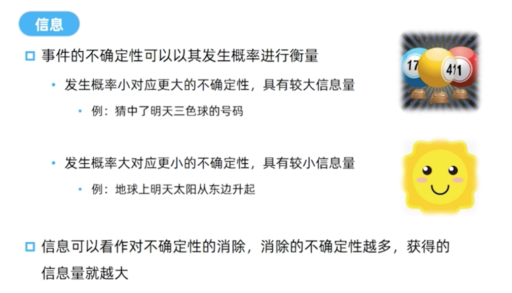
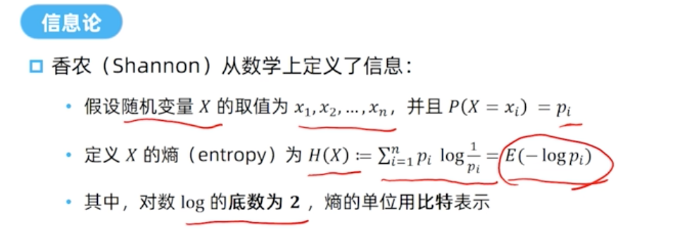
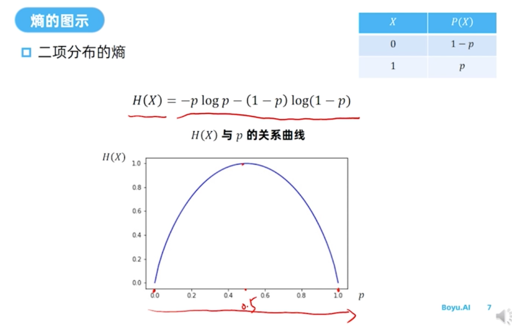
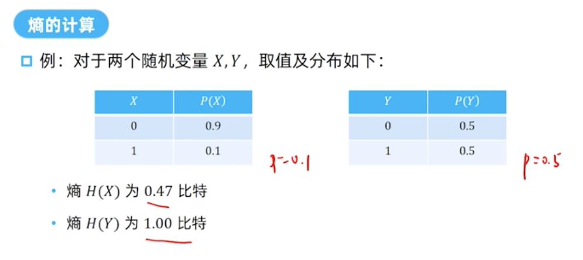
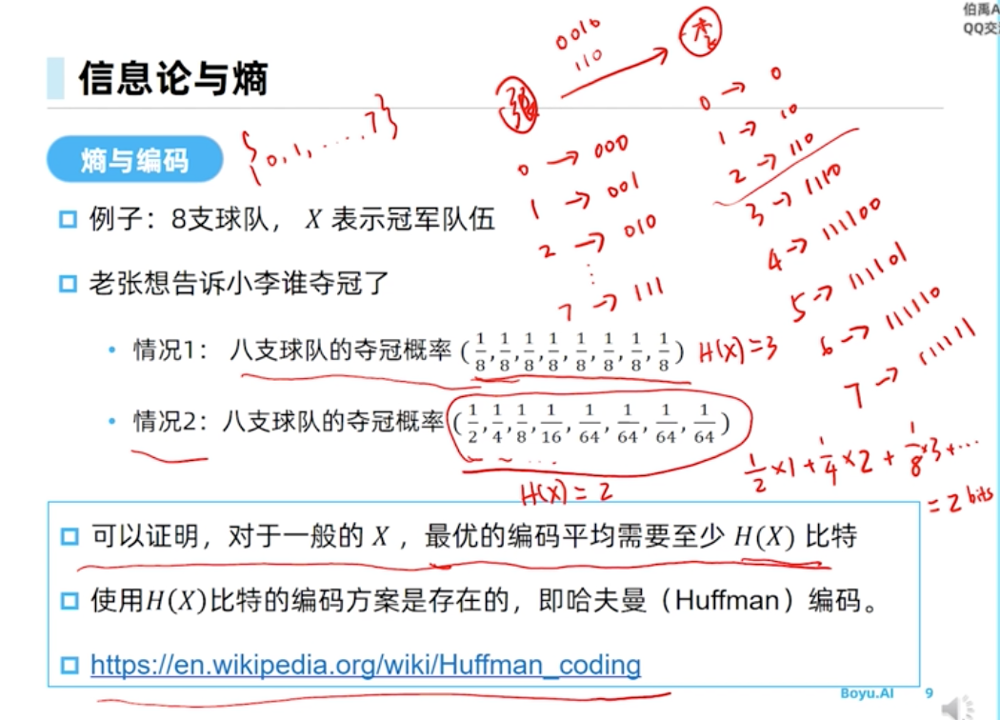
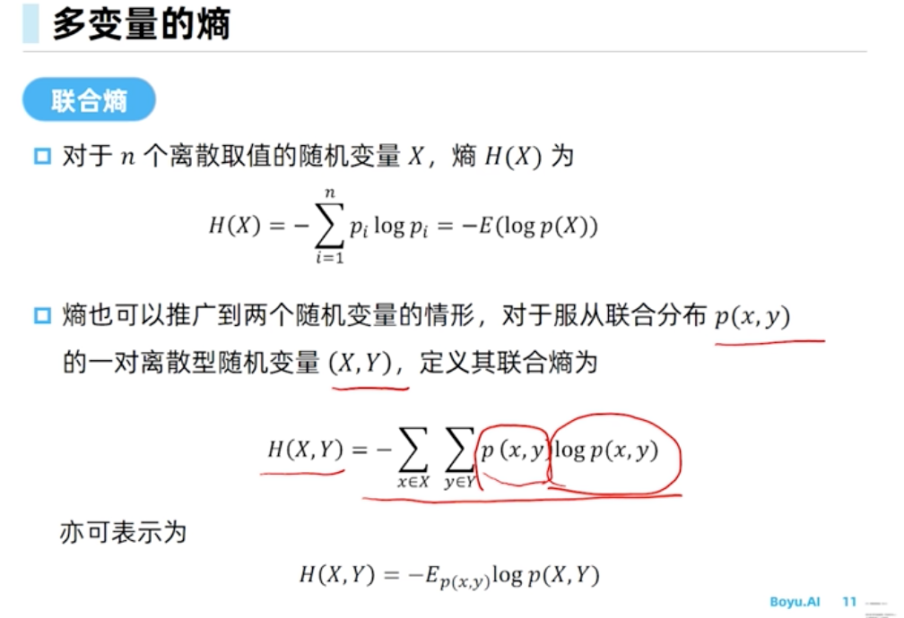
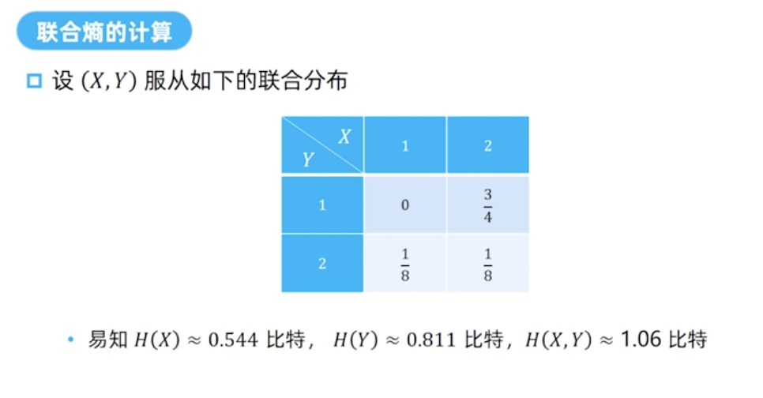

## 1.信息论与熵
[课程视频连接](https://www.boyuai.com/elites/course/D91JM0bv72Zop1D3/video/Ws3eg5n_eyBSs1kJZxv46)

* * *

如何从数学上定义一个随机变量包含的信息呢？

为了回答这个问题，引入`熵`的概念。

香浓从数学的角度，定义了“说话很有信息量”的概念。

下面的熵，就是随机变量X的信息量。最后等于`-log pi`的期望。可见，熵的`取值 [0, 1]`。

其中，pi小于等于1，故log pi为负数，所以log前面取负号。

* * *

观察H(X)的取值随p的变化，在p=0.5的时候，H(X)最大；p=0.5的时候为0或1的概率五五开，不确定性最大，这个时候，熵也理应最大了，是1比特。

* * *

下图，左右的分布律，可以当做是两队获胜的概率。

左边是第一场比赛，A队获胜概率90%，第二场比赛A队获胜概率50%。换句话说，第一场比赛不确定性比较小，第二场比赛不确定性高。

计算出来熵的结果也反映我们的理解。

* * *

再往下看，为什么熵定量地衡量了信息量？

再看例子，这个例子复杂点。老张知道谁夺冠，但是他只能发送二进制信息。也就是说，老张把夺冠信息通过编码的方式告诉小李的。

对应8个整数，最常用的就是3位二进制表示。比如，010代表二队夺冠，111代表七队夺冠。所以，不管谁夺冠，发送的信息量都是3个比特。

现在的问题是，3比特的编码方案是否是最优的？

该问题的结果，取决于随机变量X的分布：
* 对于情况1：八支队伍夺冠等概率，那么就需要用3比特来发送编码
* 对于情况2：八支队伍强弱不等，第一支队伍夺冠概率高，第八支队伍夺冠概率低，夺冠概率分布见下图

对于情况2，就存在一个平均比3bits更少位数的编码方案。

即霍夫曼编码：高概率夺冠队伍用少比特表示，低概率的球队用长比特变式。

看下图的红字，情况2的编码方式的平均只需要2 bits。

总之，对于概率分布比较平均（均匀分布），所使用的编码长度就会比较长；概率分布高低显著，编码长度就短。

再看熵，情况1的熵H(X)=3，情况2的熵H(X)=2，恰恰反映了各自编码平均所需要的位数。也可以理解为什么熵的单位是`比特`。

## 2.多变量的熵

