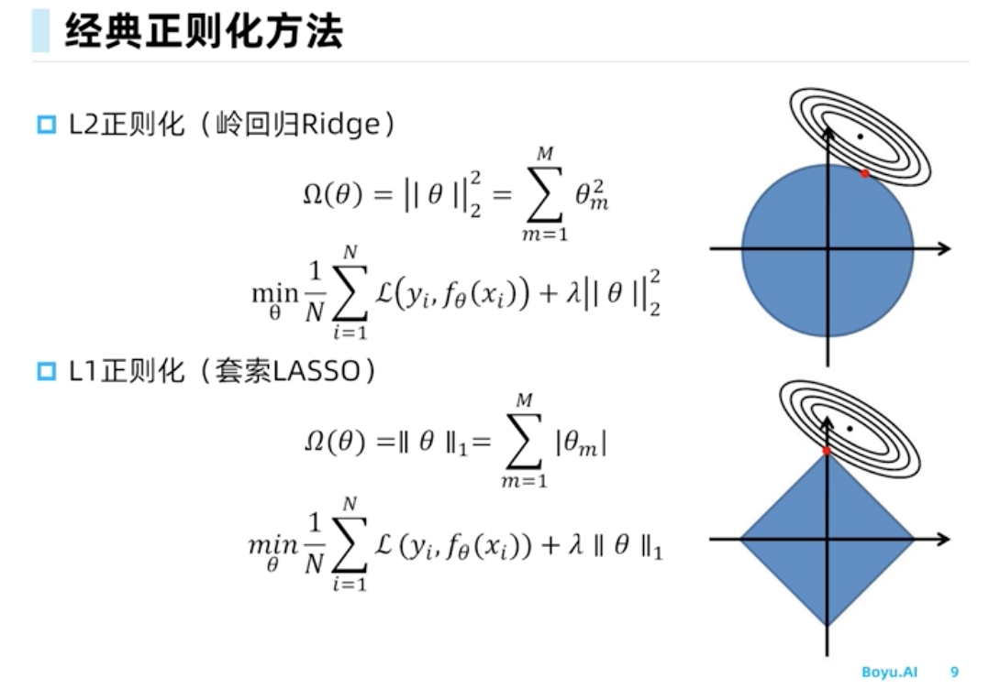
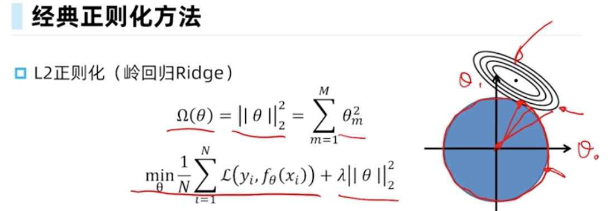
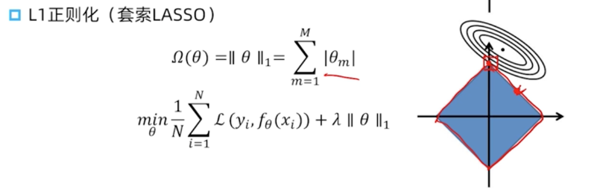
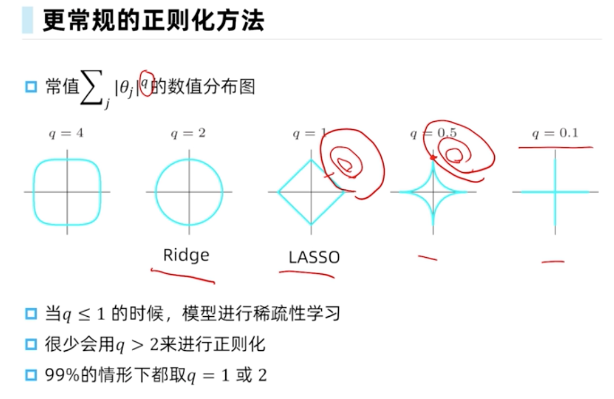
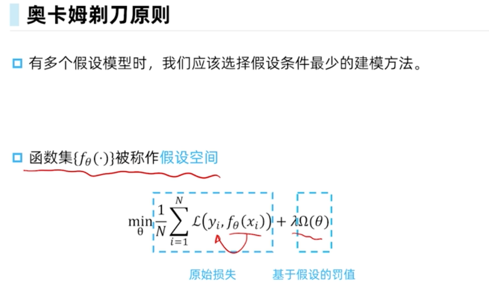
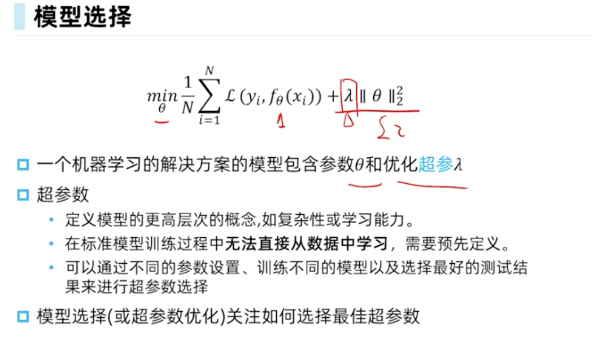

# 70.01 模型选择
[课程视频连接](https://www.boyuai.com/elites/course/5ICEBwpbHVwwnK3C/video/LKfIeIS7-G0LmWtiWWUQ8)

## 1.欠拟合与过拟合

* 欠拟合：无法捕捉数据的基础变化趋势，也就是说规律什么的没找出来，就欠拟合。
* 过拟合：如果把噪声和误差等也考虑了就过拟合。

## 2.正则化Regularization

过拟合有一种解决方式，就是正则化。

在损失函数上加上和参数theta相关的一项，大部分都是以下两种正则化方法，theta L1（套索Lasso），或者theta L2（岭回归Ridge）。

损失函数曲线和 1 范数（直角距离) 等值线 ( 满足 |x|+|y| = 常数 ) 或2范数（直线距离）等值线相切时，切点处距离最短。以取得参数或参数平方的绝对值之和最小。

要求参数或参数平方的绝对值之和最小的原因：在参数个数一定（也就是模型的阶数一定）的情况下，参数越大，模型就越不平滑，不平滑往往意味着过拟合。

要求参数或参数平方的绝对值之和最小，可以保证各个参数不会太大，从而抑制模型的过拟合。



这里L1和L2是theta的范数，是向量的一个性质。
[向量范数](https://blog.csdn.net/qq_25847123/article/details/90400678)

惩罚项将参数的范数，作为最小化目标函数的一部分，以此限制参数的取值不能任意大。

以线性模型为例，这样做的好处可以减少参数的数目（如：lasoo方法），使得参数着眼于有效的特征的组合。

这样在训练阶段，模型就不会单单着眼于与训练数据之间的偏差，也就是减弱了过拟合现象。

### L2（岭回归Ridge）

二范式计算向量的方式。

图中的坐标，theta0和theta1分别是横纵坐标，构成圆形：
```math
r^2 = theta0^2 + theta1^2
```

再看损失函数。若模型是线性的，并损失函数选择均方差的形式，则损失函数的图像是左上角的等高线的形式。



上图中，等高线和圆形的切点，就是满足具体某一个损失函数(具体的某组theta参数)获得的最小的正则化因子惩罚项（theta^2的和最小值就在圆的边界上，圆的大小由半径r决定）。

### L1（套索Lasso）

theta为变量，取绝对值函数画出的图形是下图的菱形。

椭圆与菱形相切很容易切到菱形的角上，所以拉索回归很容易取到参数为0的解：



因为theta>自己是个向量。用向量的各个项的绝对值得总和（L1）或者各个项的平方的加和（L2）来限制theta>的各个项的大小，这样对于其对应的x中的那一项，导数就不会过大，曲线就不会太复杂。

假设theta只有两项，那L1画出来就是菱形，因为L1是abs(theta1)+abs(theta2)=k。k越大菱形越大，坐标轴上四个点分别是(k,0), (0,k), (-k,0), (0, -k)。L2画出来就是圆形，因为L2是theta1的平方+theta2的平方=k。等高线是均方误差关于theta1，theta2的样子，因为本身是个抛物线立体起来的样子。当限制了theta的范数<=k的时候，相当于只能从阴影部分取theta，等高线内圈的均方误差小于外圈，>所以既要均方误差小，又要范数小，相当于在范数=k的地方找最接近内圈的地方，那一定是和某一个等高线的切点。这个等高线上所有的theta对应的损失函数的值是相等的。如果不引入范数，那求出>的theta就是等高线的正中心，也就是最内圈。另外如果不加范数，有的时候不一定能求出theta，因为求解过程要求矩阵可逆，但是矩阵不一定是满秩的。加了范数就可逆了，就一定有唯一解。

### 更常规的正则化方法



很多时候，还都是用L1和L2回归。L2会使模型学习的效果更好；L1会使模型学习更加简洁，摈弃不重要的特征。

## 3.奥卡姆剃刀原则

有多个假设模型的时候，我们应该选择假设条件最少的建模方法。比如少用些特征，或者特征间的交互模式比较简单。



下图中，超参数(hyperameter)lamda是无法学习出来的，是预先定义的。与之比较，参数(parameter)是学出来的。

如果lamda是优化出来的，那就往小里取就好了，越小，损失函数越小。比如，lamda直接取-10000就完了。

 

对模型的选择就是去调整这个超参数，咋调呢？交叉验证。

## 4.交叉验证

k折，完整数据集分成原始训练数据和原始测试数据，把原始训练数据随机分成K份数据集，基于同一个lamda，每个数据集单独训练，测试，得到模型的评价，对K个评价取平均作为lamda>的评价，调整lamda让评价变好。选定lamda重新训练完整数据集。